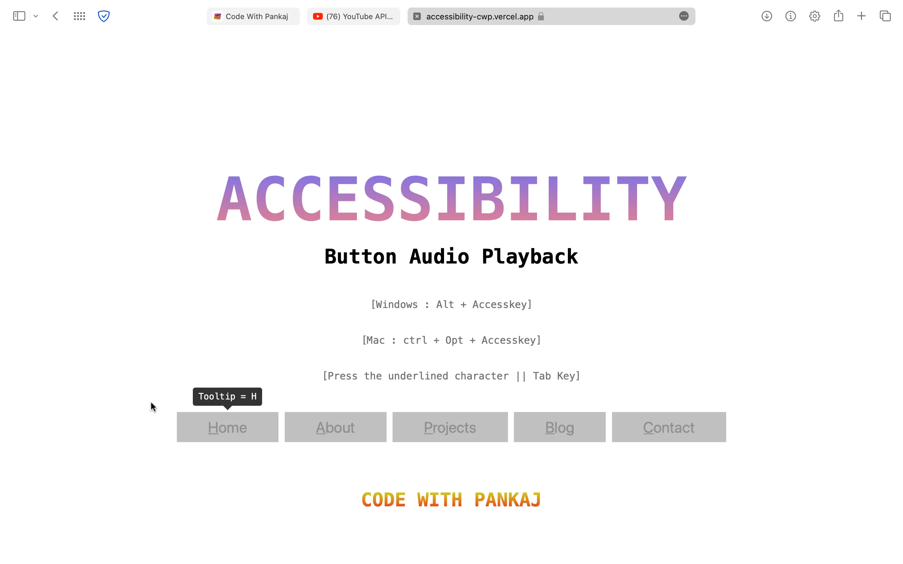

# Accessibility

This website is in Easy English and Plain English for people with disabilities with pictures to help guide the knowledge on cybersecurity. 
Some of the website content in the process is for those with non-verbal communication, and using completely just pictures

## Button Audio Playback

This GitHub repository contains accessibility buttons that provide a comprehensive set of features to enable people with disabilities to access the web without too many hassles. 
The buttons are designed to be used by developers on websites and web applications, allowing users to customize their experience with a wide range of accessibility options.


## Features

 - All buttons are accessible through keyboard
 - All buttons are accessible through click
 - All buttons are accessible through tab

<b>This project is about to educating cybersecurity for people with disabilities</b>.<br>
You can test <ins>CyberSecurity Knowledge Hub</ins> as per below 👇<br>

 _______________
<b>********** 1st Way **********</b><br>
 you can simply <b>hover</b> over the element you will see a <b>tooltip</b> of access key. You have to just <b>press</b> that key & see the magic.<br>

 Home 👉 <b>H</b><br>
 About Us 👉 <b>A</b><br>
 CyberSecurity Knowledge Hub 👉 <b>C</b><br>
 Resources 👉 <b>R</b><br>
 Australian and New Zealand Laws 👉 <b>L</b><br>
 _______________
 <b>********** 2nd Way **********</b><br>
 <b>ONLY FOR WINDOWS</b><br>
 By using Access key 👉 "Alt + Accesskey"<br>
 Home  👉 <b>Alt + H</b><br>
 About 👉 <b>Alt + A</b><br>
 CyberSecurity Knowledge Hub 👉 <b>Alt + C</b><br>
 Resources 👉 <b>Alt + R</b><br>
 Australian and New Zealand Laws 👉 <b>Alt + L</b><br>
 _______________
  <b>********** 2nd Way **********</b><br>
 <b>ONLY FOR MAC</b><br>
 By using Access key 👉 "Alt + Accesskey"<br>
 Home 👉 <b>Ctrl + Opt + H</b><br>
 About 👉 <b>Ctrl + Opt + A</b><br>
 CyberSecurity Knowledge Hub👉 <b>Ctrl + Opt + C</b><br>
 Resources 👉 <b>Ctrl + Opt + R</b><br>
 Australian and New Zealand Laws 👉 <b>Ctrl + Opt + L</b><br>
 _______________


## Authors

- [@S Mc](https://www.github.com/mcne65)


## Contributing

Contributions are always welcome!
See `index.html` for ways to get started.
Please adhere to this project's `code of conduct`.


## Demo


## Lessons Learned

Learnt how to make the content for Cybersecurity accessible for those who might have poor to limited knowledge of English, due to disabilities. 
For example, Auslan stands for Australian Sign Language and not everyone who signs that learns English is able to get the grammar correctly or understand. 

<!--- 
## Repository to run locally

Clone the project 
```bash
  git clone https://github.com/Cyber-Quantum-Accessible/Cybersecurity-Knowledge-Hub-Easy-Read-and-Plain-English.git
```

Go to the project directory
```bash
  cd Cyber-Quantum-Accessible
```

Start code editor
```bash
  code .
```

## Screenshots



--->

## Feedback and Support

For any support or contribution questions, email daisymcneill020@gmail.com
